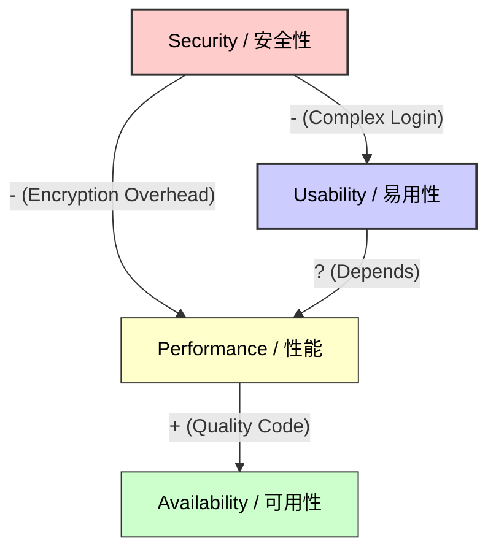
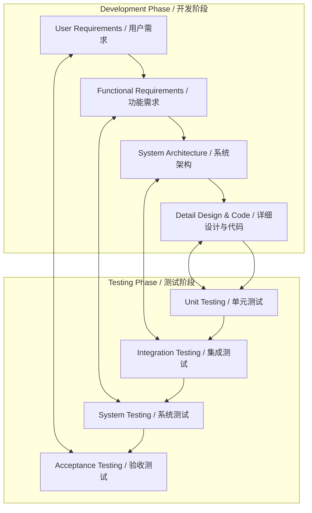

# Software Requirements Mock Exam / 软件需求模拟试题

This document contains 4 major comprehensive questions covering Elicitation, Analysis, Specification, and Validation.
这份文档包含4道综合大题，覆盖了需求获取、分析、规约和验证的所有知识点。

---

## Question 1: Requirement Elicitation & Modelling / 需求获取与建模

**Scenario / 场景:**
Develop a **"Campus Second-hand Trading Platform"** for a university. The system allows students to sell used items (books, electronics) and other students to buy them. The system also needs an Administrator to manage disputes.
开发一个大学**“校园二手交易平台”**。该系统允许学生出售二手物品（书籍、电子产品），其他学生可以购买。系统还需要通过管理员来处理纠纷。

**Requirements / 要求:**
1.  Identify at least 3 types of **Stakeholders**. / 识别至少3种**利益相关者**。
2.  Write 2 **User Stories** following the standard format ("As a..."). / 按照标准格式（“作为一个……”）写出2个**用户故事**。
3.  Draw a **Use Case Diagram** using Mermaid, including at least 3 Actors and 5 Use Cases (include `include` or `extend` relationships). / 使用Mermaid绘制**用例图**，包含至少3个参与者和5个用例（包含`include`或`extend`关系）。

### Answer / 答案

**1. Stakeholders / 利益相关者:**
*   **Student Seller (Buyer/Seller)** / 学生卖家（买家/卖家）
*   **Administrator** / 管理员
*   **System Maintainer** / 系统维护人员
*   *(Optional: University Security Dept, Payment Service Provider)*

**2. User Stories / 用户故事:**
*   **Story 1:** As a **Student Seller**, I want to **upload photos and descriptions of my items**, so that **potential buyers can see the condition of the goods**.
    *   *作为一个**学生卖家**，我想要**上传物品的照片和描述**，以便**潜在买家能看清商品状况**。*
*   **Story 2:** As a **Buyer**, I want to **search for items by category (e.g., textbooks)**, so that **I can quickly find what I need**.
    *   *作为一个**买家**，我想要**按类别（如教科书）搜索物品**，以便**我能快速找到我需要的东西**。*

**3. Use Case Diagram / 用例图:**

```mermaid
usecaseDiagram
    actor "Student Seller" as Seller
    actor "Student Buyer" as Buyer
    actor "Administrator" as Admin

    package "Trading Platform System" {
        usecase "Login" as UC1
        usecase "Post Item" as UC2
        usecase "Search Items" as UC3
        usecase "Place Order" as UC4
        usecase "Manage Disputes" as UC5
        usecase "Verify Student ID" as UC6
    }

    Seller --> UC1
    Buyer --> UC1
    Admin --> UC1

    Seller --> UC2
    Buyer --> UC3
    Buyer --> UC4
    Admin --> UC5

    %% Relationships
    UC2 ..> UC1 : <<include>>
    UC4 ..> UC1 : <<include>>
    UC4 ..> UC6 : <<include>> (Safety Check)
    UC5 ..> UC1 : <<include>>
```

---

## Question 2: Analysis & Prioritisation / 需求分析与优先级排序

**Scenario / 场景:**
For the same Trading Platform, the team proposed the following 5 features. You need to prioritise them.
对于同一个交易平台，团队提出了以下5个功能。你需要对它们进行优先级排序。

**Features / 功能列表:**
*   A: Core Login & Registration (基础登录注册)
*   B: VR product view (VR全景看图)
*   C: Basic Search & Filter (基础搜索与筛选)
*   D: AI Price Estimation (AI 估价)
*   E: In-app Chat System (站内即时聊天)

**Requirements / 要求:**
1.  Use the **Value, Cost, and Risk** model (Formula: `Priority = Value / (Cost + Risk)`) to calculate the priority. Assume weights are all 1. / 使用**价值、成本和风险**模型（公式：`优先级 = 价值 / (成本 + 风险)`）计算优先级。假设权重均为1。
2.  Fill in the table below (Estimated values provided) and rank them. / 填写下表（估算值已给出）并排序。
3.  Draw a quadrant chart using Mermaid to visualize "High Value/Low Cost" vs "Low Value/High Cost". / 使用Mermaid绘制四象限图，可视化“高价值/低成本”与“低价值/高成本”的关系。

### Answer / 答案

**1. Calculation Table / 计算表:**

| Feature | Value (1-9) | Cost (1-9) | Risk (1-9) | Calculation (V / (C+R)) | Priority Rank |
| :--- | :---: | :---: | :---: | :---: | :---: |
| **A: Login** | 9 | 3 | 1 | 9 / 4 = **2.25** | **1** |
| **B: VR View** | 3 | 8 | 8 | 3 / 16 = **0.19** | **5** |
| **C: Search** | 8 | 4 | 2 | 8 / 6 = **1.33** | **2** |
| **D: AI Price** | 4 | 7 | 6 | 4 / 13 = **0.31** | **4** |
| **E: Chat** | 7 | 5 | 3 | 7 / 8 = **0.88** | **3** |

*   **Ranking:** A > C > E > D > B
*   *Interpretation: Login is strictly necessary (High Value, Low Risk). VR is a gimmick (Low Value, High Cost/Risk).*

**2. Prioritisation Quadrant / 优先级象限图:**

```mermaid
quadrantChart
    title Feature Priority Analysis
    x-axis Low Cost/Risk --> High Cost/Risk
    y-axis Low Value --> High Value
    quadrant-1 Do Next (Strategic)
    quadrant-2 Do First (Quick Wins)
    quadrant-3 Don't Do (Waste)
    quadrant-4 Do Later (Luxury)
    
    "A: Login": [0.2, 0.9]
    "B: VR View": [0.9, 0.2]
    "C: Search": [0.3, 0.8]
    "D: AI Price": [0.8, 0.4]
    "E: Chat": [0.4, 0.7]
```

---

## Question 3: Specification & Quality Attributes / 需求规约与质量属性

**Scenario / 场景:**
The university requires the system to be **secure** (protect student privacy) and **highly available** (during exam sell-off season).
学校要求系统必须**安全**（保护学生隐私）并且**高可用**（在考试周抛售季期间）。

**Requirements / 要求:**
1.  Define **Availability** and **Security** in the context of this system. / 在此系统背景下定义**可用性**和**安全性**。
2.  Identify a potential **Trade-off** between Security and Usability. / 识别安全性与易用性之间潜在的**权衡 (Trade-off)**。
3.  Draw a **NFR (Non-Functional Requirement) Relationship Diagram** showing Positive (+) and Negative (-) impacts between: Security, Usability, Performance, Availability. / 绘制**非功能需求关系图**，展示安全性、易用性、性能、可用性之间的正向（+）和负向（-）影响。

### Answer / 答案

**1. Definitions / 定义:**
*   **Availability (可用性):** The system must handle high concurrency during the graduation season (June) with 99.9% uptime. / *系统必须在毕业季（6月）的高并发期间保持99.9%的正常运行时间。*
*   **Security (安全性):** Personal data (Student ID, Phone Number) must be encrypted. Only authenticated users from the university domain can log in. / *个人数据（学号、电话）必须加密。只有来自大学域名的认证用户才能登录。*

**2. Trade-off (权衡):**
*   **Security vs Usability:** Enforcing heavy security (e.g., Two-Factor Authentication every time, complex passwords, 5-minute session timeouts) makes the system *safer* but *harder to use* (annoying for students).
*   *安全性 vs 易用性：强制执行严格的安全措施（如每次双重认证、复杂密码、5分钟会话超时）会使系统更安全，但也更难用（让学生感到烦躁）。*

**3. NFR Relationship Diagram / 关系图:**



---

## Question 4: Validation & Process / 验证与过程

**Scenario / 场景:**
The development is finished. Now you need to ensure the system works as expected.
开发已完成。现在你需要确保系统按预期工作。

**Requirements / 要求:**
1.  Explain the difference between **Verification** and **Validation**. / 解释**验证 (Verification)** 与 **确认 (Validation)** 的区别。
2.  Draw the **V-Model**, clearly labeling the 4 levels of requirements/design and their corresponding test levels. / 绘制 **V模型**，清晰标注4个需求/设计层级及其对应的测试层级。
3.  Which test stage corresponds to **User Requirements**? / 哪一个测试阶段对应**用户需求**？

### Answer / 答案

**1. Verification vs Validation / 区别:**
*   **Verification (Are we building the product RIGHT?):** Checks if the software conforms to the specification (e.g., Code Review, Unit Tests). / *验证（我们在正确地构建产品吗？）：检查软件是否符合规格说明书（如代码审查、单元测试）。*
*   **Validation (Are we building the RIGHT product?):** Checks if the software meets the user's actual needs (e.g., Acceptance Tests, User Feedback). / *确认（我们在构建正确的产品吗？）：检查软件是否满足用户的实际需求（如验收测试、用户反馈）。*

**2. The V-Model Diagram / V模型图:**



**3. Correspondence / 对应关系:**
*   **User Requirements** correspond to **Acceptance Testing**.
*   ***用户需求** 对应 **验收测试**。*
