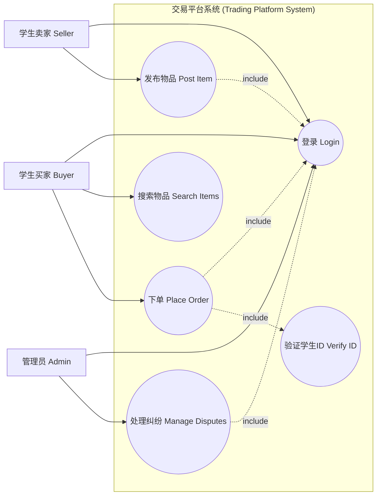
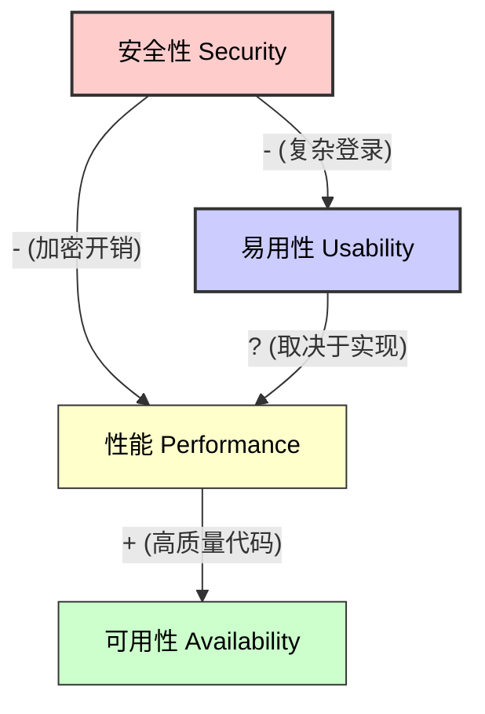
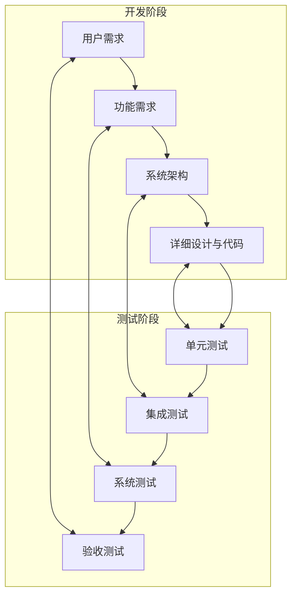
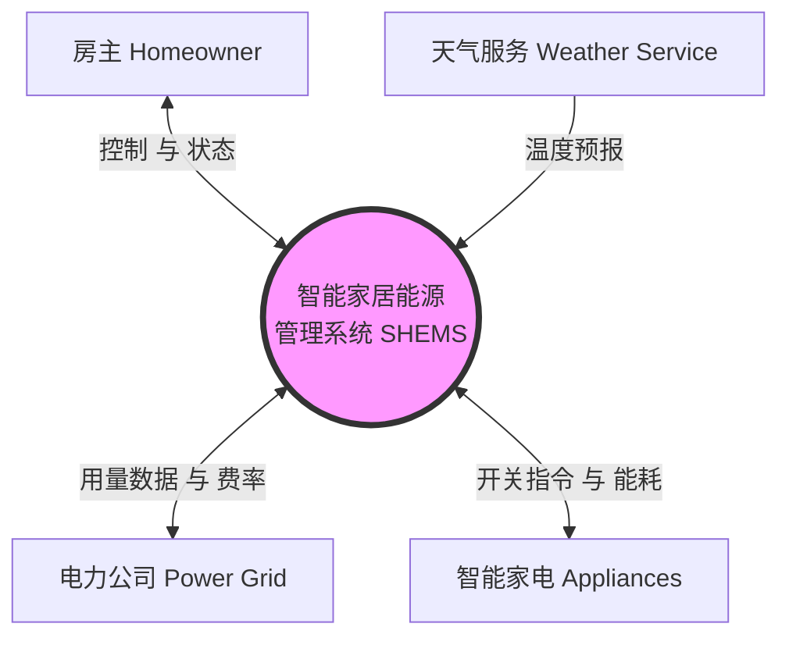

# 软件需求模拟试题

这份文档包含6道综合大题，覆盖了需求获取、分析、规约、验证以及业务需求的所有知识点。

---

## 第一题：需求获取与建模

**场景:**
开发一个大学**“校园二手交易平台”**。该系统允许学生出售二手物品（书籍、电子产品），其他学生可以购买。系统还需要通过管理员来处理纠纷。

**要求:**
1.  识别至少3种**利益相关者**。
2.  按照标准格式（“作为一个……”）写出2个**用户故事**。
3.  使用 Mermaid 绘制**用例图**，包含至少3个参与者和5个用例（包含 `include` 或 `extend` 关系）。

### 答案

**1. 利益相关者:**
*   **学生卖家（买家/卖家）**
*   **管理员**
*   **系统维护人员**
*   *（可选：大学安保部门，支付服务提供商）*

**2. 用户故事:**
*   **故事 1:** 作为一个**学生卖家**，我想要**上传物品的照片和描述**，以便**潜在买家能看清商品状况**。
*   **故事 2:** 作为一个**买家**，我想要**按类别（如教科书）搜索物品**，以便**我能快速找到我需要的东西**。

**3. 用例图:**



---

## 第二题：需求分析与优先级排序

**场景:**
对于同一个交易平台，团队提出了以下5个功能。你需要对它们进行优先级排序。

**功能列表:**
*   A: 基础登录注册
*   B: VR全景看图
*   C: 基础搜索与筛选
*   D: AI 估价
*   E: 站内即时聊天

**要求:**
1.  使用**价值、成本和风险**模型（公式：`优先级 = 价值 / (成本 + 风险)`）计算优先级。假设权重均为1。
2.  填写下表（估算值已给出）并排序。
3.  使用 Mermaid 绘制四象限图，可视化“高价值/低成本”与“低价值/高成本”的关系。

### 答案

**1. 计算表:**

| 功能 | 价值 (1-9) | 成本 (1-9) | 风险 (1-9) | 计算 (V / (C+R)) | 优先级排名 |
| :--- | :---: | :---: | :---: | :---: | :---: |
| **A: 登录** | 9 | 3 | 1 | 9 / 4 = **2.25** | **1** |
| **B: VR全景** | 3 | 8 | 8 | 3 / 16 = **0.19** | **5** |
| **C: 搜索** | 8 | 4 | 2 | 8 / 6 = **1.33** | **2** |
| **D: AI估价** | 4 | 7 | 6 | 4 / 13 = **0.31** | **4** |
| **E: 聊天** | 7 | 5 | 3 | 7 / 8 = **0.88** | **3** |

*   **排名:** A > C > E > D > B
*   *解读: 登录是必须的（高价值，低风险）。VR 是噱头（低价值，高成本/风险）。*

**2. 优先级象限图:**

```mermaid
graph TD
    classDef q1 fill:#e1f5fe,stroke:#01579b,stroke-width:2px;
    classDef q2 fill:#e8f5e9,stroke:#2e7d32,stroke-width:2px;
    classDef q3 fill:#ffebee,stroke:#c62828,stroke-width:2px;
    classDef q4 fill:#fff3e0,stroke:#ef6c00,stroke-width:2px;

    subgraph Q2 [第二象限: 优先做]
        direction TB
        A[A: 登录\n(高价值, 低成本)]
        C[C: 搜索\n(高价值, 中成本)]
    end

    subgraph Q1 [第一象限: 其次做]
        direction TB
        E[E: 聊天\n(高价值, 中成本)]
    end

    subgraph Q4 [第四象限: 稍后做]
        direction TB
        D[D: AI估价\n(中价值, 高成本)]
        B[B: VR全景\n(低价值, 高成本)]
    end

    subgraph Q3 [第三象限: 不做/浪费]
        direction TB
        X[浪费]
    end

    class Q1 q1
    class Q2 q2
    class Q3 q3
    class Q4 q4
```

---

## 第三题：需求规约与质量属性

**场景:**
学校要求系统必须**安全**（保护学生隐私）并且**高可用**（在考试周抛售季期间）。

**要求:**
1.  在此系统背景下定义**可用性**和**安全性**。
2.  识别安全性与易用性之间潜在的**权衡 (Trade-off)**。
3.  绘制**非功能需求关系图**，展示安全性、易用性、性能、可用性之间的正向（+）和负向（-）影响。

### 答案

**1. 定义:**
*   **可用性 (Availability):** 系统必须在毕业季（6月）的高并发期间保持99.9%的正常运行时间。
*   **安全性 (Security):** 个人数据（学号、电话）必须加密。只有来自大学域名的认证用户才能登录。

**2. 权衡 (Trade-off):**
*   **安全性 vs 易用性:** 强制执行严格的安全措施（如每次双重认证、复杂密码、5分钟会话超时）会使系统更安全，但也更难用（让学生感到烦躁）。

**3. NFR 关系图:**



---

## 第四题：验证与过程

**场景:**
开发已完成。现在你需要确保系统按预期工作。

**要求:**
1.  解释**验证 (Verification)** 与 **确认 (Validation)** 的区别。
2.  绘制 **V模型**，清晰标注4个需求/设计层级及其对应的测试层级。
3.  哪一个测试阶段对应**用户需求**？

### 答案

**1. 区别:**
*   **验证 (Verification) - 我们在正确地构建产品吗？:** 检查软件是否符合规格说明书（如代码审查、单元测试）。
*   **确认 (Validation) - 我们在构建正确的产品吗？:** 检查软件是否满足用户的实际需求（如验收测试、用户反馈）。

**2. V模型图:**



**3. 对应关系:**
*   **用户需求** 对应 **验收测试**。

---

## 第五题：业务需求与范围

**场景:**
一家初创公司想要开发一个**“智能家居能源管理系统”** (SHEMS)。该系统监控家用电器的用电量，根据电价优化能源消耗，并允许通过移动应用进行远程控制。

**要求:**
1.  使用标准模板编写**愿景陈述**：*For [目标客户], Who [需求陈述], The [产品名称] is a [产品类别] that [核心利益]. Unlike [主要竞争对手], our product [主要差异化陈述].*
2.  使用Mermaid绘制**上下文图 (Context Diagram)**。包含系统 (SHEMS) 和至少4个外部实体（如用户、智能家电、电力公司、天气服务）。
3.  提供2个**成功度量指标**的例子（一个财务指标，一个非财务指标）。

### 答案

**1. 愿景陈述:**
*   **针对 (For)** 具有环保意识的房主
*   **他们 (Who)** 想要减少电费和碳足迹
*   **这个 (The)** 智能家居能源管理系统 (SHEMS)
*   **是一个 (Is a)** 智能家庭自动化解决方案
*   **它能 (That)** 自动优化家电使用时间表以使用最便宜的电力
*   **不同于 (Unlike)** 传统的需手动操作的智能插座或基础监控App
*   **我们的产品 (Our product)** 使用AI预测使用模式并集成实时电网定价以实现自动省钱。

**2. 上下文图:**



**3. 成功度量指标:**
*   **财务:** 在第一年内为房主平均节省20%的月度电费。
*   **非财务:** 在设置和使用的便捷性方面达到4.5/5的用户满意度评分 (CSAT)。

---

## 第六题：利益相关者与用户类别

**场景:**
继续使用 **“智能家居能源管理系统”** 的场景。

**要求:**
1.  解释用于识别用户类别的**“先扩展后收缩” (Expand then Contract)** 原则。
2.  为“精通技术的房主”类别定义一个**用户画像 (User Persona)**。包含姓名、年龄、目标和痛点。
3.  **产品冠军 (Product Champion)** 的角色是什么？

### 答案

**1. 先扩展后收缩:**
*   **扩展 (Expand):** 头脑风暴尽可能多的潜在用户类别（如父母、孩子、客人、老人、Airbnb租客、宠物）。
*   **收缩 (Contract):** 将具有相似需求或使用模式的群体合并为主要用户类别，以避免冗余（如将“父母”和“Airbnb房东”合并为“管理员用户”）。

**2. 用户画像:**
*   **姓名:** Alex
*   **年龄:** 32
*   **角色:** 软件工程师，早期采用者
*   **目标:** 想要完全控制每一个设备；想要看详细的数据图表；想要集成到 Home Assistant。
*   **痛点:** 讨厌封闭的生态系统；当自动化失败且没有日志时感到沮丧；不喜欢订阅费。

**3. 产品冠军:**
*   特定用户类别的关键成员，作为该用户群体与业务分析师（BA）之间的主要接口。他们为该用户类别提供需求、回答问题并解决冲突。
