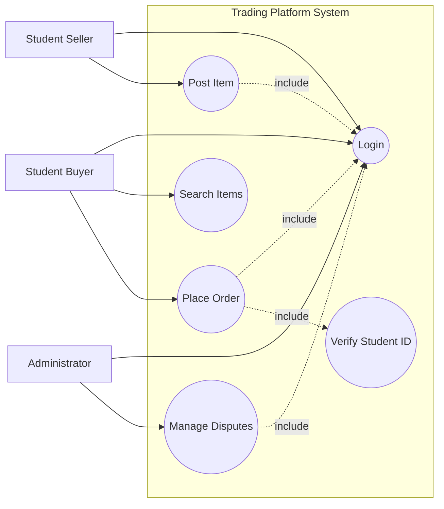
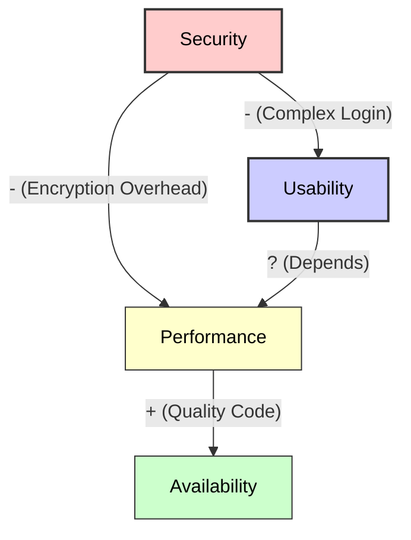
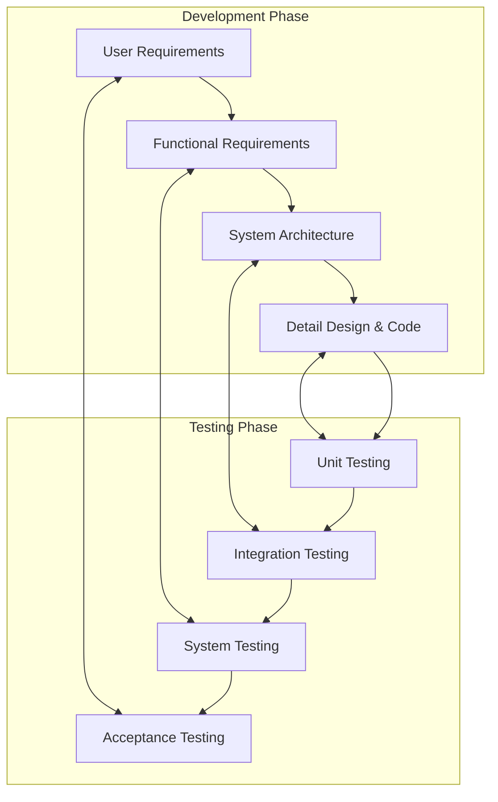
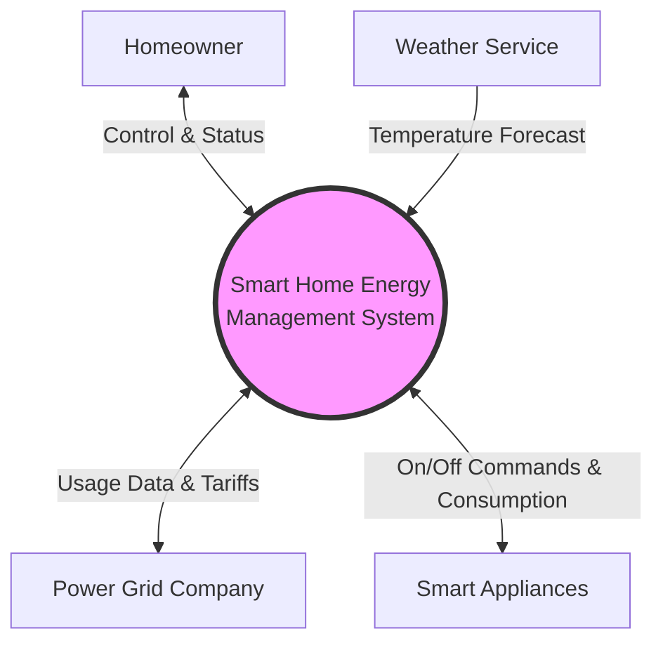
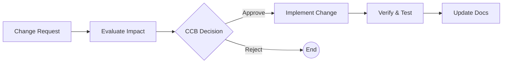

# Software Requirements Mock Exam

This document contains 6 major comprehensive questions covering Elicitation, Analysis, Specification, Validation, and Business Requirements.

---

## Question 1: Requirement Elicitation & Modelling

**Scenario:**
Develop a **"Campus Second-hand Trading Platform"** for a university. The system allows students to sell used items (books, electronics) and other students to buy them. The system also needs an Administrator to manage disputes.

**Requirements:**
1.  Identify at least 3 types of **Stakeholders**.
2.  Write 2 **User Stories** following the standard format ("As a...").
3.  Draw a **Use Case Diagram** using Mermaid, including at least 3 Actors and 5 Use Cases (include `include` or `extend` relationships).

### Answer

**1. Stakeholders:**
*   **Student Seller (Buyer/Seller)**
*   **Administrator**
*   **System Maintainer**
*   *(Optional: University Security Dept, Payment Service Provider)*

**2. User Stories:**
*   **Story 1:** As a **Student Seller**, I want to **upload photos and descriptions of my items**, so that **potential buyers can see the condition of the goods**.
*   **Story 2:** As a **Buyer**, I want to **search for items by category (e.g., textbooks)**, so that **I can quickly find what I need**.

**3. Use Case Diagram:**



---

## Question 2: Analysis & Prioritisation

**Scenario:**
For the same Trading Platform, the team proposed the following 5 features. You need to prioritise them.

**Features:**
*   A: Core Login & Registration
*   B: VR product view
*   C: Basic Search & Filter
*   D: AI Price Estimation
*   E: In-app Chat System

**Requirements:**
1.  Use the **Value, Cost, and Risk** model (Formula: `Priority = Value / (Cost + Risk)`) to calculate the priority. Assume weights are all 1.
2.  Fill in the table below (Estimated values provided) and rank them.
3.  Draw a quadrant chart using Mermaid to visualize "High Value/Low Cost" vs "Low Value/High Cost".

### Answer

**1. Calculation Table:**

| Feature | Value (1-9) | Cost (1-9) | Risk (1-9) | Calculation (V / (C+R)) | Priority Rank |
| :--- | :---: | :---: | :---: | :---: | :---: |
| **A: Login** | 9 | 3 | 1 | 9 / 4 = **2.25** | **1** |
| **B: VR View** | 3 | 8 | 8 | 3 / 16 = **0.19** | **5** |
| **C: Search** | 8 | 4 | 2 | 8 / 6 = **1.33** | **2** |
| **D: AI Price** | 4 | 7 | 6 | 4 / 13 = **0.31** | **4** |
| **E: Chat** | 7 | 5 | 3 | 7 / 8 = **0.88** | **3** |

*   **Ranking:** A > C > E > D > B
*   *Interpretation: Login is strictly necessary (High Value, Low Risk). VR is a gimmick (Low Value, High Cost/Risk).*

**2. Prioritisation Quadrant:**

```mermaid
graph TD
    classDef q1 fill:#e1f5fe,stroke:#01579b,stroke-width:2px;
    classDef q2 fill:#e8f5e9,stroke:#2e7d32,stroke-width:2px;
    classDef q3 fill:#ffebee,stroke:#c62828,stroke-width:2px;
    classDef q4 fill:#fff3e0,stroke:#ef6c00,stroke-width:2px;

    subgraph Q2 [Quadrant 2: Do First]
        direction TB
        A[A: Login\n(High Value, Low Cost)]
        C[C: Search\n(High Value, Med Cost)]
    end

    subgraph Q1 [Quadrant 1: Do Next]
        direction TB
        E[E: Chat\n(High Value, Med Cost)]
    end

    subgraph Q4 [Quadrant 4: Do Later]
        direction TB
        D[D: AI Price\n(Med Value, High Cost)]
        B[B: VR View\n(Low Value, High Cost)]
    end

    subgraph Q3 [Quadrant 3: Avoid]
        direction TB
        X[Waste]
    end

    class Q1 q1
    class Q2 q2
    class Q3 q3
    class Q4 q4
```

---

## Question 3: Specification & Quality Attributes

**Scenario:**
The university requires the system to be **secure** (protect student privacy) and **highly available** (during exam sell-off season).

**Requirements:**
1.  Define **Availability** and **Security** in the context of this system.
2.  Identify a potential **Trade-off** between Security and Usability.
3.  Draw a **NFR (Non-Functional Requirement) Relationship Diagram** showing Positive (+) and Negative (-) impacts between: Security, Usability, Performance, Availability.

### Answer

**1. Definitions:**
*   **Availability:** The system must handle high concurrency during the graduation season (June) with 99.9% uptime.
*   **Security:** Personal data (Student ID, Phone Number) must be encrypted. Only authenticated users from the university domain can log in.

**2. Trade-off:**
*   **Security vs Usability:** Enforcing heavy security (e.g., Two-Factor Authentication every time, complex passwords, 5-minute session timeouts) makes the system *safer* but *harder to use* (annoying for students).

**3. NFR Relationship Diagram:**



---

## Question 4: Validation & Process

**Scenario:**
The development is finished. Now you need to ensure the system works as expected.

**Requirements:**
1.  Explain the difference between **Verification** and **Validation**.
2.  Draw the **V-Model**, clearly labeling the 4 levels of requirements/design and their corresponding test levels.
3.  Which test stage corresponds to **User Requirements**?

### Answer

**1. Verification vs Validation:**
*   **Verification (Are we building the product RIGHT?):** Checks if the software conforms to the specification (e.g., Code Review, Unit Tests).
*   **Validation (Are we building the RIGHT product?):** Checks if the software meets the user's actual needs (e.g., Acceptance Tests, User Feedback).

**2. The V-Model Diagram:**



**3. Correspondence:**
*   **User Requirements** correspond to **Acceptance Testing**.

---

## Question 5: Business Requirements & Scope

**Scenario:**
A startup wants to build a **"Smart Home Energy Management System"** (SHEMS). The system monitors electricity usage of home appliances, optimizes energy consumption based on electricity rates, and allows remote control via a mobile app.

**Requirements:**
1.  Write a **Vision Statement** using the standard template: *For [target customer], Who [statement of need], The [product name] is a [product category] that [key benefit]. Unlike [primary competitive alternative], our product [statement of primary differentiation].*
2.  Draw a **Context Diagram** using Mermaid. Include the System (SHEMS) and at least 4 External Entities (e.g., User, Smart Appliance, Power Grid Company, Weather Service).
3.  Provide 2 examples of **Success Metrics** (one Financial, one Non-financial).

### Answer

**1. Vision Statement:**
*   **For** environmentally conscious homeowners
*   **Who** want to reduce electricity bills and carbon footprint
*   **The** Smart Home Energy Management System (SHEMS)
*   **Is a** intelligent home automation solution
*   **That** automatically optimizes appliance usage schedules to use the cheapest electricity
*   **Unlike** traditional manual smart plugs or basic monitoring apps
*   **Our product** uses AI to predict usage patterns and integrates real-time grid pricing for automatic savings.

**2. Context Diagram:**



**3. Success Metrics:**
*   **Financial:** Save homeowners an average of 20% on monthly electricity bills within the first year.
*   **Non-Financial:** Achieve a User Satisfaction Score (CSAT) of 4.5/5 regarding the ease of setup and usage.

---

## Question 6: Stakeholders & User Classes

**Scenario:**
Continuing with the **"Smart Home Energy Management System"**.

**Requirements:**
1.  Explain the **"Expand then Contract"** principle for identifying user classes.
2.  Define a **User Persona** for the "Tech-Savvy Homeowner" class. Include Name, Age, Goals, and Pain Points.
3.  What is the role of a **Product Champion**?

### Answer

**1. Expand then Contract:**
*   **Expand:** brainstorm as many potential user categories as possible (e.g., parents, children, guests, elderly, Airbnb renters, pets).
*   **Contract:** merge groups with similar needs or usage patterns into primary user classes to avoid redundancy (e.g., merge "Parents" and "Airbnb Renters" into "Admin User").

**2. User Persona:**
*   **Name:** Alex
*   **Age:** 32
*   **Role:** Software Engineer, Early Adopter
*   **Goals:** Wants full control over every device; wants to see detailed data graphs; wants to integrate with Home Assistant.
*   **Pain Points:** Hates closed ecosystems; frustrated when automation fails without logs; dislikes subscription fees.

**3. Product Champion:**
*   A key member of a specific user class who serves as the primary interface between that user community and the Business Analyst. They provide requirements, answer questions, and resolve conflicts for their user class.

---

## Question 7: Requirement Management & Traceability

**Scenario:**
The project is mid-way through development, but the client keeps changing requirements. The team is lost on which code corresponds to which requirement.

**Requirements:**
1.  Define **Requirements Traceability Matrix (RTM)** and explain its two main benefits (e.g., for Change Impact Analysis).
2.  What is the responsibility of the **CCB (Change Control Board)**?
3.  Draw a **Change Control Process** using Mermaid (e.g., Request -> Evaluate -> Decision -> Implement -> Verify).

### Answer

**1. Traceability Matrix:**
*   A document (usually a table) that links user requirements to functional requirements, and then to design, code, and test cases.
*   **Benefits:**
    1.  **Change Impact Analysis:** Quickly identify which modules need update when a requirement changes.
    2.  **Coverage Analysis:** Ensure all requirements are implemented and tested (no missing features).

**2. CCB Role:**
*   A group of stakeholders (Project Manager, BA, Client, Tech Lead) that decides whether to **approve** or **reject** proposed changes based on scope, cost, and feasibility.

**3. Change Control Process:**



---

## Question 8: Process Improvement & Risk Management

**Scenario:**
The previous project failed due to "Scope Creep" (uncontrolled expansion of requirements). The team wants to improve the process for the next project.

**Requirements:**
1.  Use **Root Cause Analysis (Five Whys)** to explain how to find the real reason for a problem (give a brief example).
2.  Define **Scope Creep** and one method to prevent it.
3.  Draw a **Risk Management Process** diagram (Identify -> Analyze -> Rank -> Handle -> Monitor).

### Answer

**1. Root Cause Analysis (Five Whys):**
*   A technique to drill down to the root cause by asking "Why" at least 5 times.
*   *Example: Project late? -> Why? (Too many changes) -> Why? (Reqs unclear) -> Why? (Users not involved) -> Root Cause: Lack of user engagement.*

**2. Scope Creep:**
*   **Definition:** The uncontrolled growth of project scope as requirements are added without adjustments to time, cost, or resources.
*   **Prevention:** Strictly follow the **Change Control Process** (all changes must go through CCB).

**3. Risk Management Process:**

```mermaid
graph TD
    ID[Identify Risk] --> Analyze[Analyze (Likelihood x Impact)]
    Analyze --> Rank[Rank & Prioritize]
    Rank --> Handle[Handle (Mitigate/Avoid)]
    Handle --> Monitor[Monitor & Review]
    Monitor -.-> ID
```

